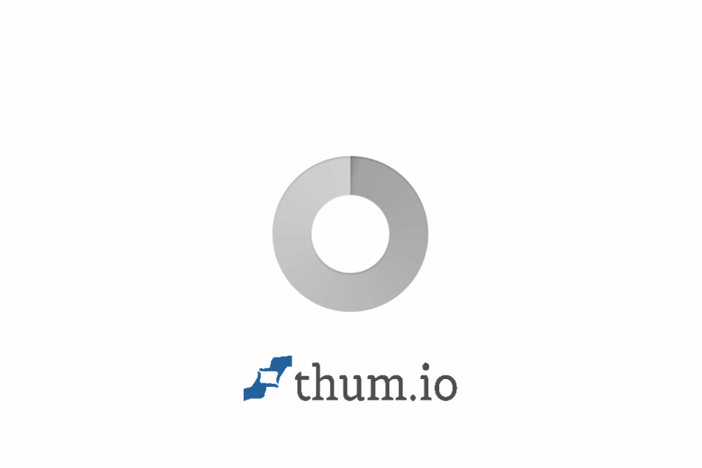
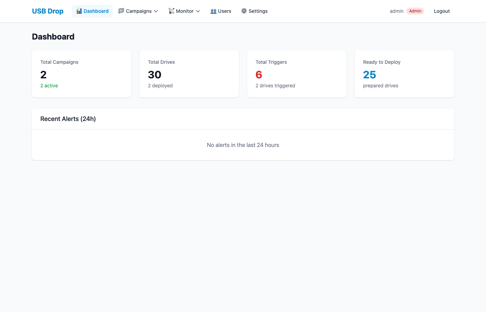
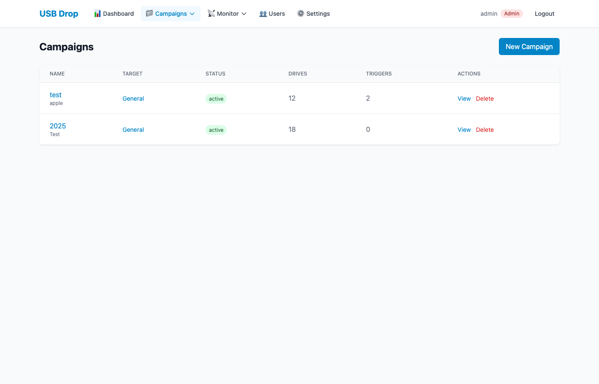
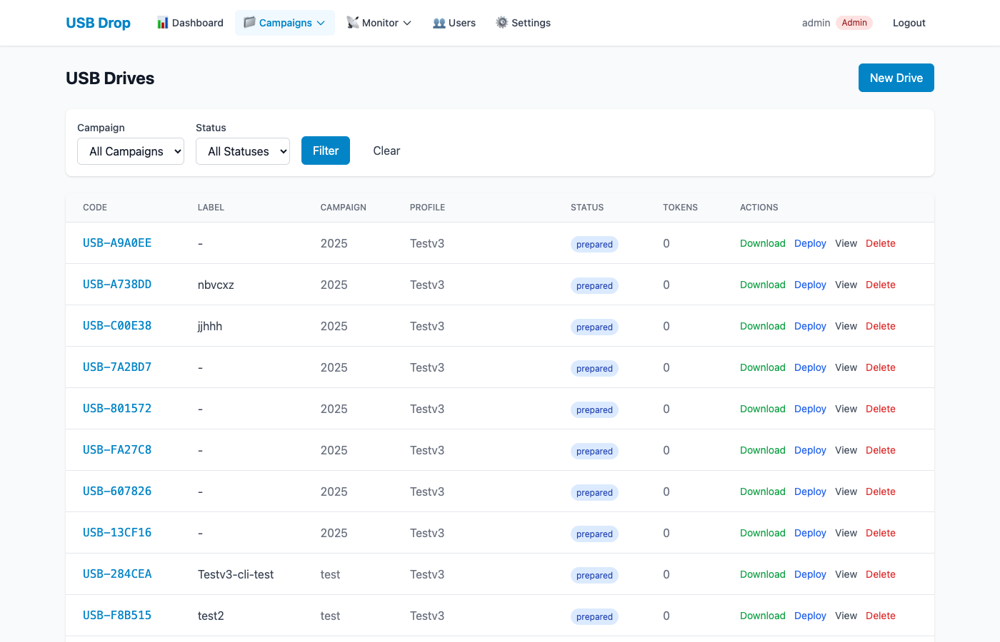
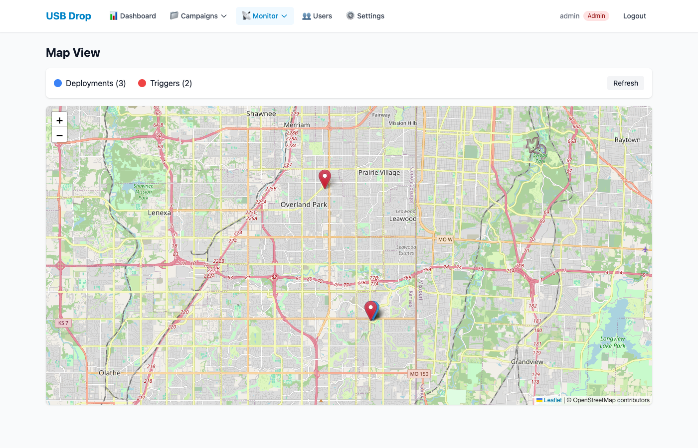
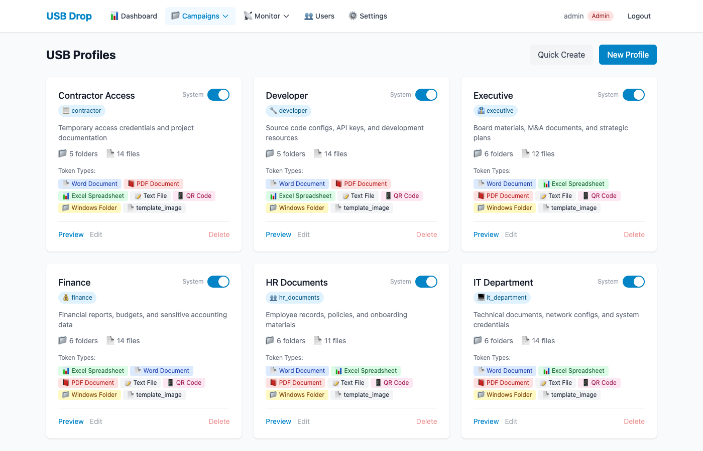
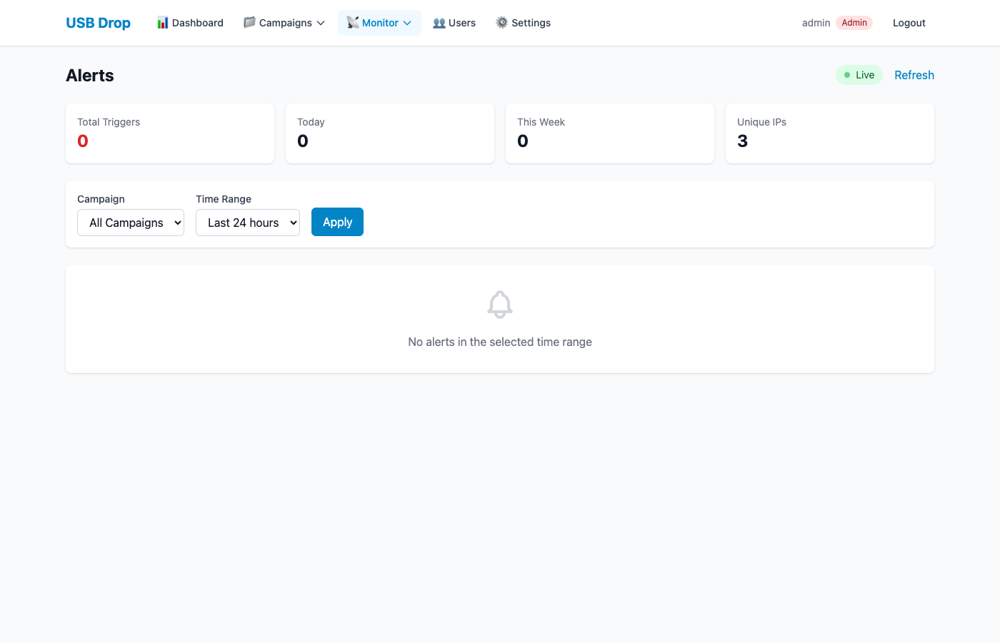

# USB Drop Campaign Management System

A comprehensive platform for managing USB drop penetration testing campaigns with integrated CanaryTokens, real-time alerting, and AI-generated content.


---

> **⚠️ AUTHORIZATION REQUIRED**
>
> This tool is designed **exclusively for authorized security assessments**. USB drop testing is a social engineering technique that requires:
>
> - **Written authorization** from the asset owner
> - **Defined scope** specifying physical locations and timeframes
> - **Rules of Engagement (ROE)** document
> - **Legal review** confirming compliance with local laws
> - **Incident response plan** for unintended access
>
> **Before using this tool, ensure you have documented approval.** Unauthorized USB drop testing may violate computer fraud laws, trespassing laws, and organizational policies.

---

## Overview

This system streamlines USB drop security assessments by providing:

- **Automated Token Generation** - Integration with self-hosted CanaryTokens for DNS, Word, Excel, PDF, and other token types
- **Campaign Management** - Organize drives by client, track deployment locations, and monitor trigger events
- **USB Profiles** - Reusable templates with AI-generated content (documents, images) for realistic scenarios
- **Real-time Alerts** - WebSocket-based notifications with Slack integration
- **Geographic Tracking** - Interactive map visualization of deployment locations (blue) and trigger events (red) with detailed popups
- **CLI Tool** - Command-line interface for field operators preparing and deploying drives

## Screenshots

### Login Page


### Dashboard


### Campaigns


### USB Drives


### Deployment Map


### Profile Templates


### Alert Feed


## Architecture

```
                    Internet
                        |
                    [Caddy]
                   /   |   \
                  /    |    \
        [Frontend] [API] [CanaryTokens]
                   |
              [PostgreSQL]
```

All services run in Docker containers on a single VPS with Caddy providing automatic HTTPS.

## Features

### Campaign Manager Web UI
- Dashboard with real-time statistics
- Campaign and profile management
- **12 pre-configured scenario profiles** with AI-generated images
- Drive preparation wizard with automatic token and image inclusion
- Interactive map with deployment/trigger markers
- Alert feed with filtering
- Editable deployment details (even after triggers are received)
- Campaign reports with charts and CSV export
- **Settings page** for Shlink URL shortener configuration (admin-only)
- **URL shortening** with customizable slugs per profile
- **Unique URLs per link** - Each URL placeholder in text files gets a unique short URL for believability

### CLI Tool
- Interactive and scripted modes
- Direct USB drive writing
- Batch drive preparation
- Field deployment recording with GPS

### Landing Pages
- **11 themed redirect pages**: corporate, login, maintenance, helpdesk, hrportal, fileshare, training, banking, document, survey, onlyfans
- Per-campaign configuration with preview links
- **Configurable redirect delay** (1-30 seconds) per campaign
- Visitor logging (IP, user agent, referer) before redirect
- Configurable target URLs via environment variables

## Technology Stack

| Component | Technology |
|-----------|------------|
| Backend API | FastAPI (Python 3.11+) |
| Frontend | Vue 3 + Vite + Tailwind CSS |
| Database | PostgreSQL 16 |
| Container Orchestration | Docker Compose |
| CanaryTokens | Self-hosted Docker deployment |
| Reverse Proxy | Caddy (automatic HTTPS) |
| AI Generation | OpenAI API (GPT-4 + DALL-E 3) |
| Maps | Leaflet.js + OpenStreetMap |
| Real-time | WebSockets |
| URL Shortening | Shlink (optional) |

## Quick Start

### Prerequisites

- VPS with 8GB+ RAM, 2+ CPU cores, 40GB+ disk (Debian 12/13 recommended)
- Docker and Docker Compose v2+
- **Two domains** pointed to your VPS:
  - **App domain** (e.g., `app.example.com`, `api.example.com`) - Campaign Manager
  - **Canary domain** (e.g., `tokens.example.com`) - CanaryTokens server
- Ports 80 and 443 open for HTTPS traffic
- (Optional) Cloudflare account for wildcard SSL certificates

### 1. Clone and Configure

```bash
git clone https://github.com/CarbonRaven/USB-Drop--CanaryTokens.git
cd USB-Drop--CanaryTokens

# Copy and edit environment configuration
cp .env.example .env
nano .env
```

### 2. Configure Required Variables

Generate secure secrets first:
```bash
# Run these commands and paste results into .env
openssl rand -hex 32  # For DB_PASSWORD
openssl rand -hex 32  # For JWT_SECRET_KEY
openssl rand -hex 32  # For FACTORY_AUTH
openssl rand -hex 32  # For REDIS_PASSWORD
```

| Variable | Required | Description |
|----------|----------|-------------|
| `VPS_IP` | Yes | Your server's public IP address |
| `DB_PASSWORD` | Yes | PostgreSQL database password |
| `JWT_SECRET_KEY` | Yes | Secret for JWT tokens |
| `REDIS_PASSWORD` | Yes | Redis password |
| `ADMIN_USERNAME` | Yes | Initial admin account username |
| `ADMIN_PASSWORD` | Yes | Initial admin account password (12+ chars, mixed case, number, symbol) |
| `CANARY_DOMAIN` | Yes | Domain for CanaryTokens (e.g., `tokens.example.com`) |
| `FACTORY_AUTH` | Yes | CanaryTokens factory auth token |
| `WEBHOOK_URL` | Yes | URL for CanaryTokens alerts callback (e.g., `https://api.example.com/api/webhooks/canary`) |
| `CLOUDFLARE_API_TOKEN` | Conditional | Required for wildcard SSL (CanaryTokens subdomains) |
| `OPENAI_API_KEY` | No | For AI content/image generation |
| `SLACK_WEBHOOK_URL` | No | For Slack alert notifications |
| `IPINFO_TOKEN` | No | For IP geolocation in alerts |
| `SHLINK_API_KEY` | No | For URL shortening via Shlink |
| `SHLINK_DOMAIN` | No | Short URL domain (e.g., `links.example.com`) |

### 3. Deploy

```bash
# Start CanaryTokens stack first
docker compose -f docker-compose.canarytokens.yml up -d

# Wait for CanaryTokens to be ready (check logs)
docker compose -f docker-compose.canarytokens.yml logs -f

# Start Campaign Manager
docker compose up -d --build
```

### 4. Verify Deployment

```bash
# Check all containers are running
docker ps

# Test API health
curl -s https://api.yourdomain.com/health | jq

# Test CanaryTokens connectivity (from API container)
docker exec usb-drop-api-1 curl -s http://canarytokens-frontend:8082/generate

# Check for errors in logs
docker compose logs api --tail 50
```

### 5. Access

- **Campaign Manager**: `https://app.yourdomain.com`
- **API**: `https://api.yourdomain.com`
- **CanaryTokens**: `https://tokens.yourdomain.com` (basic auth protected)

Login with your `ADMIN_USERNAME` and `ADMIN_PASSWORD`.

### 6. Generate API Key (for CLI)

1. Login to the Campaign Manager web UI
2. Navigate to **Settings** → **API Keys**
3. Click **Generate New Key**
4. Copy and save the key securely (it won't be shown again)

## CLI Installation

```bash
cd usb-drop-cli
pip install -e .

# Configure
usb-drop config set-api https://api.yourdomain.com
usb-drop config set-key <your-api-key-from-step-6>

# Verify connection
usb-drop list-campaigns

# Prepare a drive
usb-drop prepare --interactive
```

## Project Structure

```
USB-Drop--CanaryTokens/
├── campaign-api/          # FastAPI backend
│   ├── app/
│   │   ├── models/        # SQLAlchemy models
│   │   ├── routers/       # API endpoints
│   │   └── services/      # Business logic
│   └── Dockerfile
├── campaign-frontend/     # Vue 3 frontend
│   ├── src/
│   │   ├── views/         # Page components
│   │   ├── stores/        # Pinia state
│   │   └── services/      # API client
│   └── Dockerfile
├── usb-drop-cli/          # Python CLI tool
│   └── usb_drop/
├── landing-pages/         # Redirect pages
│   └── rickroll/
├── docs/                  # Documentation
│   ├── DEPLOYMENT.md      # Full VPS setup instructions
│   ├── API.md             # Complete endpoint documentation
│   ├── CLI.md             # Command-line tool usage
│   ├── BELIEVABILITY_RESEARCH.md
│   ├── PROFILE_WIZARD_DESIGN.md
│   └── PROFILE_WIZARD_RESEARCH.md
├── docker-compose.yml
├── docker-compose.canarytokens.yml
├── Caddyfile
└── .env.example
```

## Documentation

| Document | Description |
|----------|-------------|
| [Deployment Guide](docs/DEPLOYMENT.md) | Full VPS setup, SSL, networking |
| [API Reference](docs/API.md) | Complete endpoint documentation |
| [CLI Guide](docs/CLI.md) | Command-line tool usage |
| [Believability Research](docs/BELIEVABILITY_RESEARCH.md) | Metadata injection techniques |
| [Profile Wizard Design](docs/PROFILE_WIZARD_DESIGN.md) | UI component architecture |
| [Profile Wizard Research](docs/PROFILE_WIZARD_RESEARCH.md) | UX research and decisions |

## Pre-Configured Profiles

The system includes 12 ready-to-use scenario profiles, each with:
- Realistic file structures with multiple token types
- AI-generated images (DALL-E 3) for authenticity
- Suggested USB labels for each scenario

| Category | Profiles |
|----------|----------|
| **Corporate** | IT Department, HR Documents, Finance, Executive, Network Admin |
| **Personal** | Personal/Found Drive, Training/Compliance, Social Creator, Project/Client |
| **Technical** | Developer, Security Audit, Contractor Access |

Each profile automatically includes:
- Word, Excel, and PDF documents with embedded tokens
- Text files with tracking URLs
- QR codes for mobile engagement
- Folder tokens (desktop.ini) for Windows
- AI-generated photos in a Photos folder

## Supported Token Types

| Token Type | File Extension | Trigger Event |
|------------|----------------|---------------|
| **Word Document** | `.docx` | Document opened |
| **Excel Spreadsheet** | `.xlsx` | Spreadsheet opened |
| **PDF Document** | `.pdf` | PDF viewed |
| **DNS Token** | (embedded) | DNS resolution |
| **HTTP URL** | `.txt`, `.url` | Link clicked |
| **QR Code** | `.png` | QR scanned and URL visited |
| **Folder Token** | `desktop.ini` | Folder opened in Windows Explorer |
| **HTML Beacon** | `.html` | HTML file opened in browser |

All tokens are generated via CanaryTokens and trigger real-time alerts with source IP, geolocation, and user agent data.

## Believability Features

Generated USB drives include multiple layers of authenticity to avoid detection as test devices:

### Metadata Injection
| File Type | Injected Metadata |
|-----------|-------------------|
| **Office Documents** | Author, Company, LastModifiedBy, TotalTime (realistic editing duration) |
| **PDF Files** | Author, Producer, Creator (matching application pairs like Word→PDF) |
| **Images** | EXIF data: Camera Make/Model, GPS coordinates, capture settings |

### Timestamp Randomization
File created/modified timestamps are randomized based on scenario type:
- **Corporate** profiles: Business hours (9-5), weekdays only
- **Personal** profiles: Evenings/weekends, varied patterns
- **Technical** profiles: Late night "developer hours"

### Automatic Junk Files
Drives include realistic system artifacts:
- `.DS_Store`, `.Spotlight-V100` (macOS)
- `Thumbs.db` (Windows thumbnail cache)
- `notes.txt`, `_README.txt` (common user files)
- Empty folders like `Documents/Archive/`, `Templates/`

### URL Shortening (Shlink Integration)
When enabled via profile or drive settings, tracking URLs are automatically shortened:
- **Automatic substitution** - All `{canary_token-*}` placeholders use short URLs
- **Unique per link** - Each placeholder in a file gets a unique short URL
- **Configurable slugs** - Base slug + random/sequential suffix (e.g., `docs-a7k2`)
- **Custom domain** - Use your own domain (e.g., `links.company.com`)
- **Believable URLs** - Short URLs appear legitimate, not like tracking links

Configure Shlink in Settings (admin only) or per-profile in the Profile Wizard.

## Workflow Example

1. **Create Campaign** - Set up a new assessment for a client
2. **Select Profile** - Choose from 12 pre-configured scenarios (or create custom)
3. **Prepare Drives** - Generate tokens and create drive packages with AI images
4. **Deploy** - Write files to USB drives, record drop locations
5. **Monitor** - Watch for token triggers in real-time
6. **Report** - Generate campaign summary with maps and statistics

## Security Considerations

- All traffic encrypted via automatic HTTPS (Caddy + Let's Encrypt)
- JWT authentication with short-lived tokens (15 min access, 7 day refresh)
- API keys for CLI/automation access
- Database isolated in Docker network
- Webhook signature validation
- Password requirements: 12+ chars, uppercase, lowercase, digit, special char

### Role-Based Access Control

| Role | Permissions |
|------|-------------|
| **Admin** | Full access: user management, settings, all operations |
| **Operator** | Manage campaigns, drives, profiles (no user management) |
| **Viewer** | Read-only access to dashboards and reports |

## Troubleshooting

### CanaryTokens not responding

```bash
# Check CanaryTokens container status
docker compose -f docker-compose.canarytokens.yml ps

# View CanaryTokens logs
docker compose -f docker-compose.canarytokens.yml logs frontend

# Test internal connectivity from API
docker exec usb-drop-api-1 curl -v http://canarytokens-frontend:8082/generate
```

### Token creation fails

1. Verify `FACTORY_AUTH` matches in both `.env` files
2. Check `WEBHOOK_URL` is accessible from the internet
3. Ensure CanaryTokens frontend container is running
4. Check API logs: `docker compose logs api --tail 100`

### Webhooks not receiving alerts

```bash
# Test webhook endpoint directly
curl -X POST https://api.yourdomain.com/api/webhooks/canary \
  -H "Content-Type: application/json" \
  -d '{"test": true}'

# Check if Caddy is routing correctly
docker logs caddy --tail 50
```

### Database connection issues

```bash
# Check Postgres is running
docker compose ps postgres

# Test connection
docker exec usb-drop-postgres-1 pg_isready -U usbdrop

# View Postgres logs
docker compose logs postgres --tail 50
```

### Drive download returns empty/corrupted ZIP

```bash
# Check drive manifest in database
docker exec usb-drop-postgres-1 psql -U usbdrop -d usbdrop \
  -c "SELECT files_manifest FROM drives WHERE unique_code = 'USB-XXXXXX';"

# Check API logs during download
docker compose logs api --tail 100 | grep -i zip
```

### Frontend not loading

```bash
# Check frontend build status
docker compose logs campaign-frontend --tail 50

# Rebuild frontend
docker compose up -d --build campaign-frontend

# Clear browser cache and hard refresh
```

## Backup & Recovery

### Database Backup

```bash
# Create backup
docker exec usb-drop-postgres-1 pg_dump -U usbdrop usbdrop > backup_$(date +%Y%m%d).sql

# Restore from backup
cat backup_20250106.sql | docker exec -i usb-drop-postgres-1 psql -U usbdrop usbdrop
```

### Uploaded Files Backup

```bash
# Backup uploads directory
docker cp usb-drop-api-1:/app/uploads ./uploads_backup_$(date +%Y%m%d)
```

## Contributing

Contributions are welcome! Please:

1. Fork the repository
2. Create a feature branch (`git checkout -b feature/amazing-feature`)
3. Commit your changes (`git commit -m 'Add amazing feature'`)
4. Push to the branch (`git push origin feature/amazing-feature`)
5. Open a Pull Request

Please ensure your code follows the existing style and includes appropriate tests.

## License

MIT License - See [LICENSE](LICENSE) for details.

## Disclaimer

This tool is designed for authorized security assessments only. The developers assume no liability for misuse. Always obtain proper written authorization before conducting USB drop tests. Unauthorized use may violate:

- Computer Fraud and Abuse Act (CFAA) in the US
- Computer Misuse Act in the UK
- Similar laws in other jurisdictions
- Organizational policies and employment agreements

**You are solely responsible for ensuring your use of this tool is lawful and authorized.**
